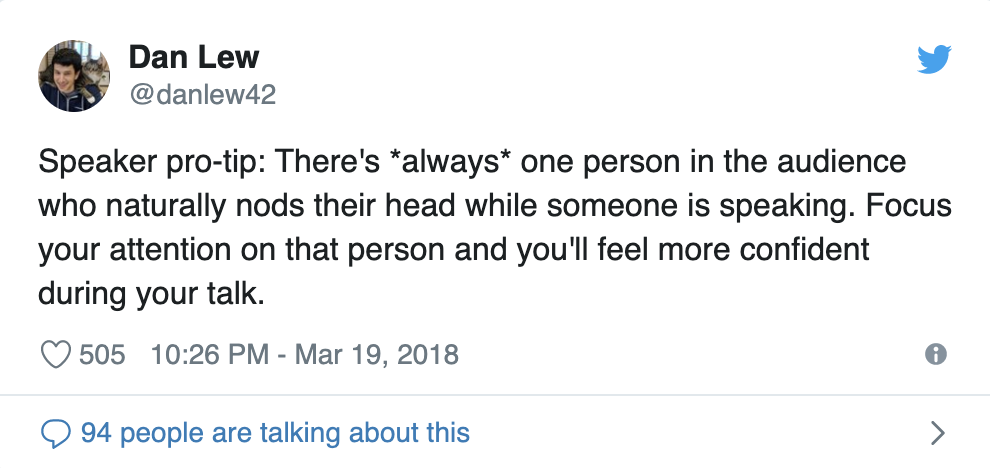

<p align="center">
	<br/>
  ✨ speak|easy ✨
</p>

<p align="center">
  
  <br/>
  <a href="https://speak-easy.netlify.com">Inspirational & Informational Public Speaking Tips</a>
</p>

<br/>

<p align="center">
  <a href="https://snyk.io//test/github/lirantal/speak-easy?targetFile=package.json"></a>
  <a href="https://app.netlify.com/sites/speak-easy/deploys"></a>

# About

The source-code for the `speak|easy` website which promotes inspirational and information public speaking tips.

Website: https://speak-easy.netlify.com

# Development

## Project setup

```
yarn install
```

## Compiles and hot-reloads for development

```
yarn run serve
```

## Compiles and minifies for production

```
yarn run build
```

## Run your tests

```
yarn run test
```

## Lints and fixes files

```
yarn run lint
```

# Author

Liran Tal <liran.tal@gmail.com>
